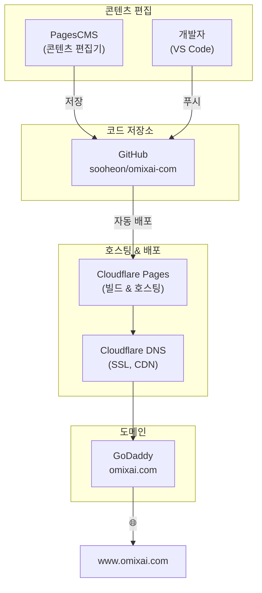
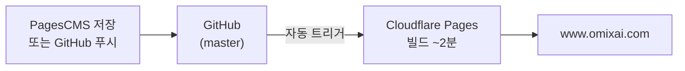
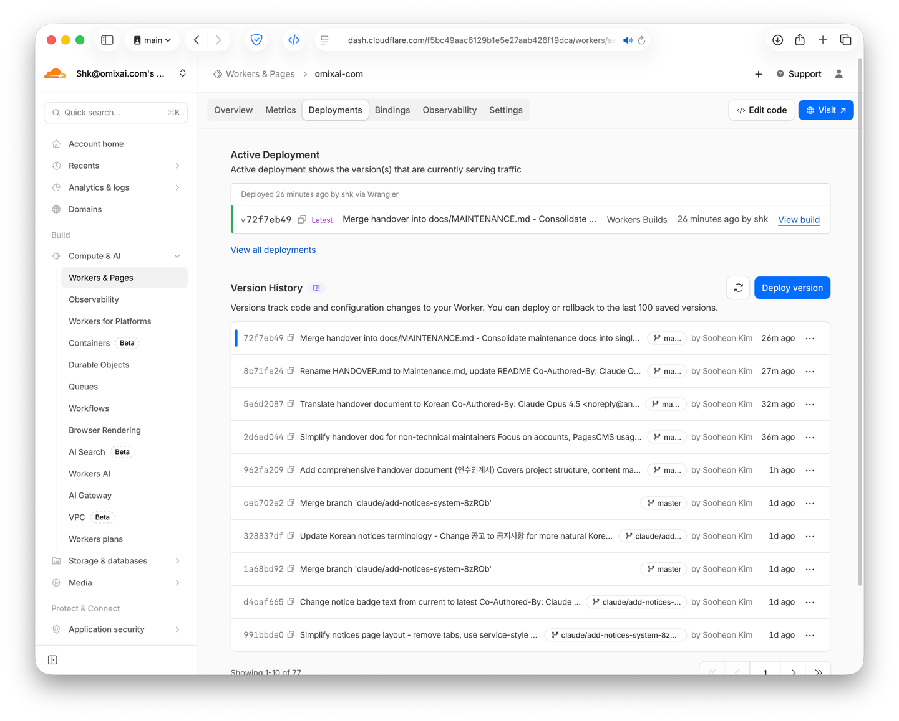
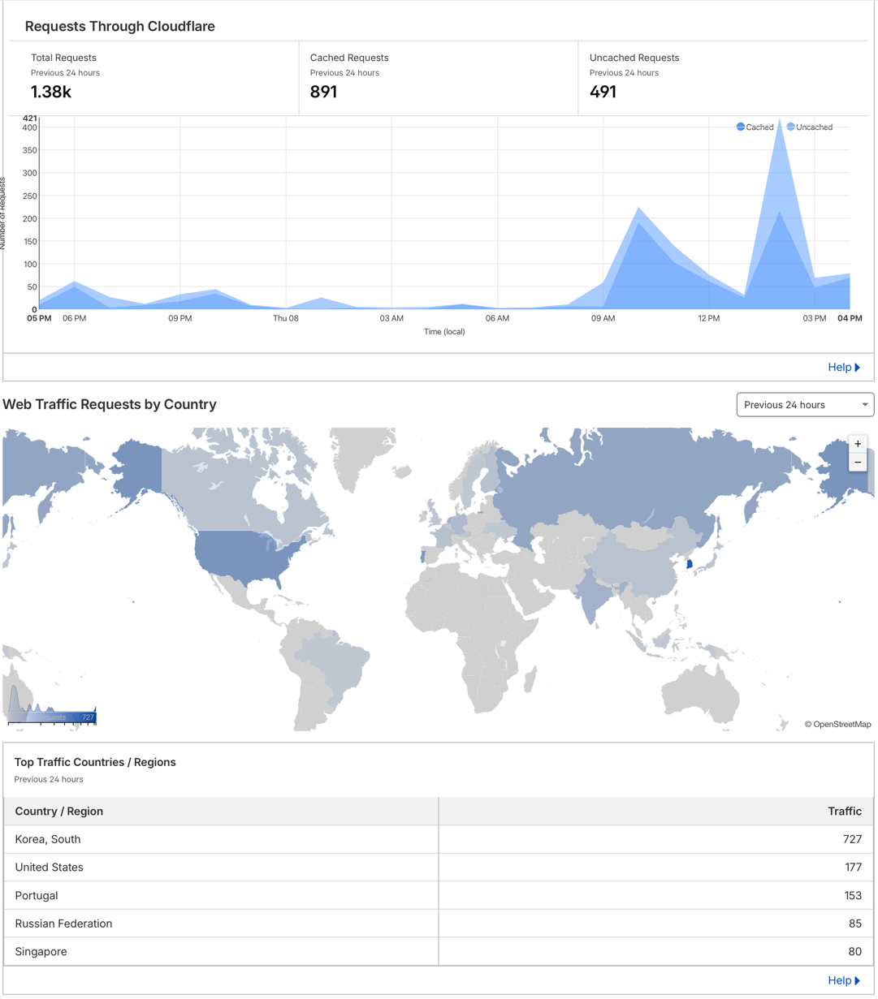

# 사이트 유지보수 가이드 (인수인계서)

> **사이트:** https://www.omixai.com
> **최종 수정일:** 2026-01-14

---

## 1. 계정 및 접근 권한

| 서비스 | 용도          | URL | 로그인  | 계정 추가 방법  |
|--------|-------------|-----|-------|-----------|
| **GitHub** | 코드 및 콘텐츠 내용 | [github.com/sooheon/omixai-com](https://github.com/sooheon/omixai-com) | @sooheon | GitHub 계정 초대 
| **Cloudflare** | 호스팅, DNS, 빌드 | [dash.cloudflare.com](https://dash.cloudflare.com) | shk@omixai.com | Cloudflare 계정 초대 
| **PagesCMS** | 콘텐츠 편집기 | [pagescms.org](https://pagescms.org) | GitHub OAuth | 이메일 계정 초대 
| **Google Search Console** | SEO, 사이트맵   | [search.google.com/search-console](https://search.google.com/search-console) | omixai0612 |
| **Naver Search Advisor** | 한국 SEO      | [searchadvisor.naver.com](https://searchadvisor.naver.com) | omixai@omixai.com |

### 시스템 구성도



### 도메인 및 DNS
- 도메인 등록: GoDaddy (omixai.com)
- DNS, SSL, CDN: Cloudflare에서 관리
- **www.omixai.com** → 메인 사이트

---

## 2. 배포 파이프라인



- **자동화**: `master`에 푸시하면 Cloudflare Pages 빌드가 자동 실행됨
- **빌드 시간**: 약 2분
- **프리뷰 빌드**: master가 아닌 브랜치는 프리뷰 URL 생성 (예: `{BRANCH}.omixai-com.pages.dev`)

### 배포 상태 확인
1. https://dash.cloudflare.com 접속
2. **Compute & AI → Workers & Pages** → **omixai-com** 이동
3. **Deployments** 탭 확인



---

## 3. PagesCMS로 콘텐츠 편집하기

웹사이트의 모든 컨텐츠는 GitHub 저장소에서 관리됩니다. 
PagesCMS는 코드 수정 없이 웹사이트 콘텐츠를 편집하는 주요 도구입니다.

계정이 없으면 

### 접속 방법
1. https://pagescms.org 접속
2. "Login with GitHub" 클릭
3. `omixai-com` 저장소 선택

### 콘텐츠 섹션

| 섹션 | 관리 내용 |
|------|----------|
| **Common** | 네비게이션 메뉴 라벨, 푸터 텍스트 |
| **Landing** | 홈페이지: 히어로, 통계, 서비스 미리보기, 고객 후기 |
| **Resources** | FAQ 질문과 답변 |
| **About** | 팀원, 투자자, 회사 연혁 |
| **Contact** | 이메일 주소, 사무실 주소 |
| **Services** | 개별 서비스 페이지 (Blood, Tissue 등) |
| **Notices** | 회사 공지사항 |

### 편집 팁
- **모든 텍스트 필드는 한국어(ko)와 영어(en)가 있습니다** - 둘 다 편집하세요
- 변경사항을 **저장**하세요
- **변경사항은 2-3분 내에 자동 배포**됩니다

### 브랜치 사용 (권장)

라이브 배포 전 변경사항을 미리보려면:

1. PagesCMS에서 사이드바 상단의 저장소 이름 클릭
2. 브랜치 드롭다운에 새 브랜치명 입력 (예: `content-update`)
3. 콘텐츠 편집 후 저장
4. Cloudflare가 `[브랜치명].omixai-com.pages.dev`에 프리뷰 빌드
5. 확인 후 GitHub에서 Pull Request 생성 및 병합

---

## 4. 주요 콘텐츠 작업

### 홈페이지 텍스트 변경
PagesCMS → **Landing** → Hero/KPIs 편집

### FAQ 수정
PagesCMS → **Resources** → FAQ 섹션 편집

### 팀원 추가/편집
PagesCMS → **About** → Team → Members

### 연락처 정보 수정
PagesCMS → **Contact** → 이메일/주소 편집

---

## 5. 공지사항 관리

공지사항은 웹사이트 상단 배너와 `/notices` 페이지에 표시됩니다.

### 새 공지사항 추가

1. PagesCMS → **Notices** → **"Add new"**
2. 필드 입력:

| 필드 | 설명 |
|------|------|
| **Slug** | URL용 ID (예: `2026-01-15-new-announcement`) |
| **Date** | 게시일 (YYYY-MM-DD 형식) |
| **Active** | 체크하면 배너에 표시됨 |
| **Title (ko/en)** | 공지 제목 (한국어, 영어 둘 다) |
| **Content (ko/en)** | 공지 본문 (마크다운 지원) |

### 공지사항 동작 방식
- 배너에는 **공지 1개만** 표시됨 ("Active" 체크된 것 중 가장 최근 것)
- **모든 공지**는 공지사항 페이지에 표시됨
- **대표이사 서명**은 자동으로 추가됨

### 마크다운 서식
```
**굵은 글씨**

1. 번호 목록
2. 다른 항목

- 글머리 기호
```

---

## 6. 서비스 관리

### 기존 서비스 편집
PagesCMS → **Services** → 서비스 선택 → 섹션 편집:
- Title/Subtitle/Description
- Features (주요 특징)
- Applications (활용 분야)
- Process (분석 과정)
- Deliverables (제공 결과물)
- Sample Requirements (샘플 요구사항)

### 새 서비스 추가
1. PagesCMS → **Services** → **"Add new"**
2. 모든 섹션 입력 (한국어와 영어 둘 다)
3. **slug** 필드가 URL을 결정함 (예: `new-service` → `/services/new-service`)

---

## 7. 웹사이트 구조

| URL | 한국어 URL | 설명 |
|-----|-----------|------|
| `/` | `/ko` | 홈페이지 |
| `/about` | `/ko/about` | 회사 소개, 팀, 투자자 |
| `/contact` | `/ko/contact` | 문의 폼 |
| `/faq` | `/ko/faq` | 자주 묻는 질문 |
| `/technical` | `/ko/technical` | 기술 문서 |
| `/notices` | `/ko/notices` | 공지사항 |
| `/services/blood` | `/ko/services/blood` | 혈액 프로테오믹스 |
| `/services/tissue` | `/ko/services/tissue` | 조직 프로테오믹스 |
| `/services/cell-culture` | `/ko/services/cell-culture` | 세포배양 프로테오믹스 |
| `/services/custom` | `/ko/services/custom` | 맞춤형 분석 |
| `/privacy` | `/ko/privacy` | 개인정보처리방침 |

---

## 8. 문의 폼 (EmailJS)

`/contact` 페이지의 문의 폼은 EmailJS를 통해 이메일을 발송합니다.

Cloudflare Pages 환경 변수:
- `PUBLIC_EMAILJS_SERVICE_ID`
- `PUBLIC_EMAILJS_TEMPLATE_ID`
- `PUBLIC_EMAILJS_PUBLIC_KEY`

---

## 9. Analytics

Cloudflare 대쉬보드에서 기본적인 접속자 분석 가능.



---

## 10. 문제 해결

### PagesCMS 저장 후 콘텐츠가 업데이트되지 않음
- 배포까지 2-3분 대기
- Cloudflare Pages에서 배포 상태 확인
- 브라우저 캐시 삭제 후 새로고침 (Cmd+Shift+R)

### 공지사항이 배너에 표시되지 않음
- **Active**가 체크되어 있는지 확인
- 날짜 형식이 올바른지 확인 (YYYY-MM-DD)

### 문의 폼이 발송되지 않음
- EmailJS 대시보드에서 오류/할당량 확인
- Cloudflare 환경 변수 확인

### 빌드 실패
- Cloudflare에서 배포 로그 확인
- 배포 실패 시 이전 버전이 유지됨
- 빌드가 계속 실패하면 개발자에게 연락

---

## 11. 빠른 참조

| 작업 | 경로 |
|------|------|
| 홈페이지 콘텐츠 수정 | PagesCMS → Landing |
| 공지사항 추가 | PagesCMS → Notices → Add new |
| FAQ 편집 | PagesCMS → Resources |
| 팀 정보 수정 | PagesCMS → About → Team |
| 서비스 페이지 편집 | PagesCMS → Services → 서비스 선택 |
| 배포 상태 확인 | Cloudflare → Pages → omixai-com → Deployments |
